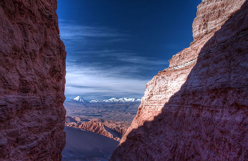

# image-palette-tools (WIP)

`image-palette-tools` is a set of related image tools:

- `extract-palette` - generates a color palette from an image
- `cluster-by-palette` - clusters a set of images by their color palettes

The tools support PNG, JPEG, and GIF images.

| Image                  |                               Palette  |
|------------------------|----------------------------------------|
|  |  |
|  |  |
|  |  |

<!-- TOC -->

- [Get it](#get-it)
- [Use it](#use-it)
    - [`extract-palette`](#extract-palette)
        - [Examples](#examples)
    - [`cluster-by-palette`](#cluster-by-palette)
        - [Examples](#examples-1)
- [Comments](#comments)

<!-- /TOC -->

## Get it

Using go get:

```sh
go get -u github.com/sgreben/image-palette-tools/cmd/extract-palette
go get -u github.com/sgreben/image-palette-tools/cmd/cluster-by-palette
```

Or [download the binaries](https://github.com/sgreben/image-palette-tools/releases/latest) from the releases page. 

```sh
# Linux
curl -L https://github.com/sgreben/image-palette-tools/releases/download/0.0.1/extract-palette_0.0.1_linux_x86_64.tar.gz | tar xz
curl -L https://github.com/sgreben/image-palette-tools/releases/download/0.0.1/cluster-by-palette_0.0.1_linux_x86_64.tar.gz | tar xz

# OS X
curl -L https://github.com/sgreben/image-palette-tools/releases/download/0.0.1/extract-palette_0.0.1_osx_x86_64.tar.gz | tar xz
curl -L https://github.com/sgreben/image-palette-tools/releases/download/0.0.1/cluster-by-palette_0.0.1_osx_x86_64.tar.gz | tar xz

# Windows
curl -LO https://github.com/sgreben/image-palette-tools/releases/download/0.0.1/extract-palette_0.0.1_windows_x86_64.zip
unzip extract-palette_0.0.1_windows_x86_64.zip

curl -LO https://github.com/sgreben/image-palette-tools/releases/download/0.0.1/cluster-by-palette_0.0.1_windows_x86_64.zip
unzip cluster-by-palette_0.0.1_windows_x86_64.zip
```

## Use it

### `extract-palette`

```text
Usage of extract-palette:
  -k int
        number of colors to extract (default 8)
  -out-json value
        path of output JSON file (go template)
  -out-png value
        path of output palette image (PNG) (go template)
  -out-png-height int
        size of each color square in the palette output image (default 100)
  -out-txt value
        path of output text file (go template)
  -p int
        number of images to process in parallel (default 8)
```

#### Examples

> For each image file, extract an 8-color palette. Generate a PNG image of the palette with suffix `-palette-8.png`. Write a JSON file containing the palette colors to a file with suffix `-palette-8.json`.

```sh
extract-palette \
      -k 8 \
      -out-png '{{.Path}}-pallette-{{.K}}.png' \
      -out-json '{{.Path}}-pallette-{{.K}}.json' \
      *.jpg
```

### `cluster-by-palette`

```text
Usage of cluster-by-palette:
  -n int
        number of image clusters to make (default 5)
  -glob value
        glob expression matching image files to cluster
  -k int
        palette size (default 4)
  -out-shell value
        shell command to run for each image (go template)
  -out-summary-json value
        path of output JSON containing the clustering (go template)
  -out-cluster-png value
        output path for cluster palette image (PNG) (go template)
  -out-cluster-png-height int
        size of each color square in the palette output image (default 100)
  -in-json value
        path to read palette JSON from (go template)
  -out-json value
        path to write palette JSON to (go template)
  -p int
        number of images to process in parallel (default 8)
```

#### Examples


> Create 8 clusters of images based on their 4-color palettes. Make directories `cluster-0`...`cluster-7` and copy the files to their respective cluster's directory. For each cluster, create PNG palette images named `cluster-8-0.png`...`cluster-8-7.png`.

```sh 
cluster-by-palette \
      -n 8 \
      -k 4 \
      -out-shell 'd="cluster-{{.Label}}"; mkdir -p "$d"; cp "{{.Path}}" "$d"' \
      -out-cluster-png "cluster-{{.N}}-{{.Label}}.png" \
      *.jpg
``` 

## Comments

Feel free to [leave a comment](https://github.com/sgreben/image-palette-tools/issues/1) or create an issue.
